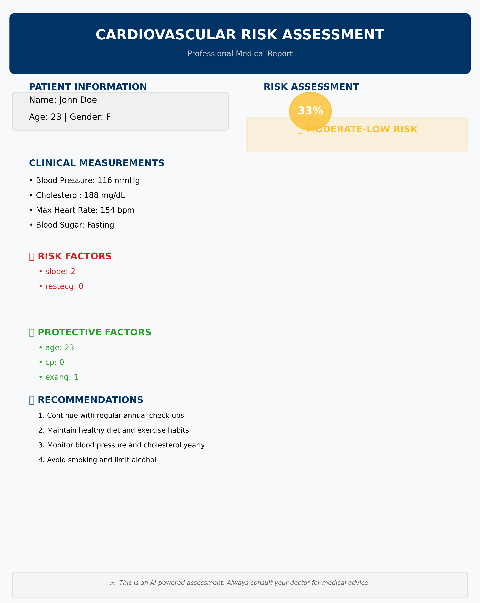
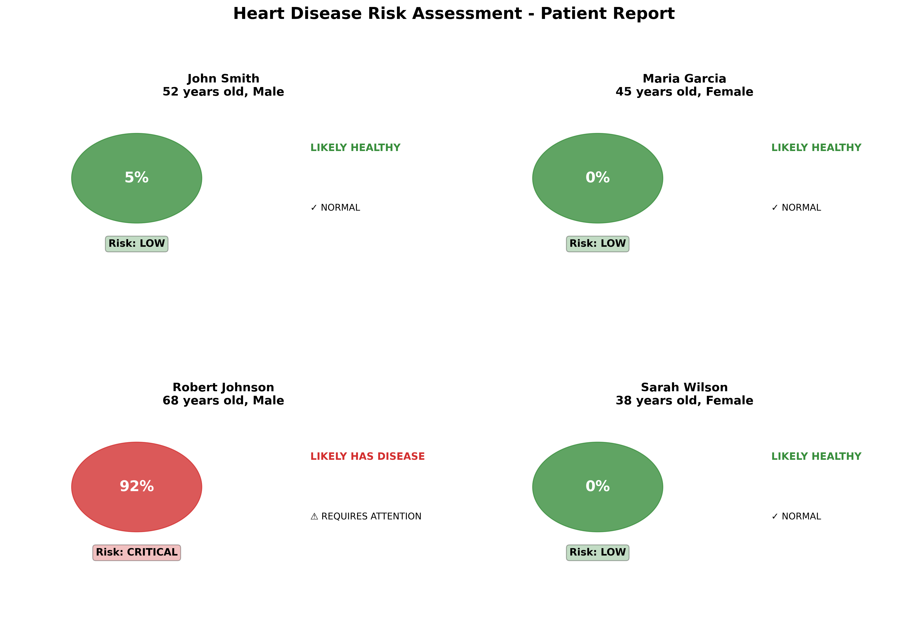
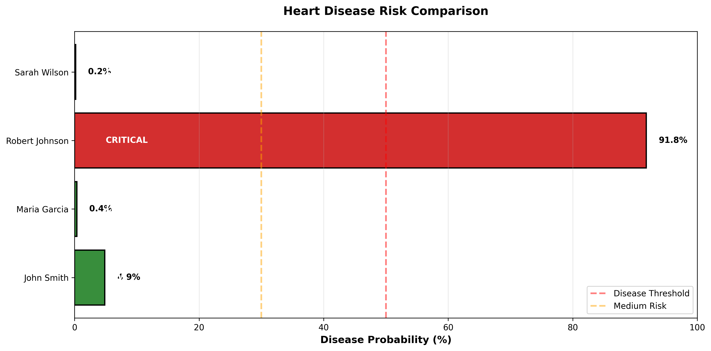
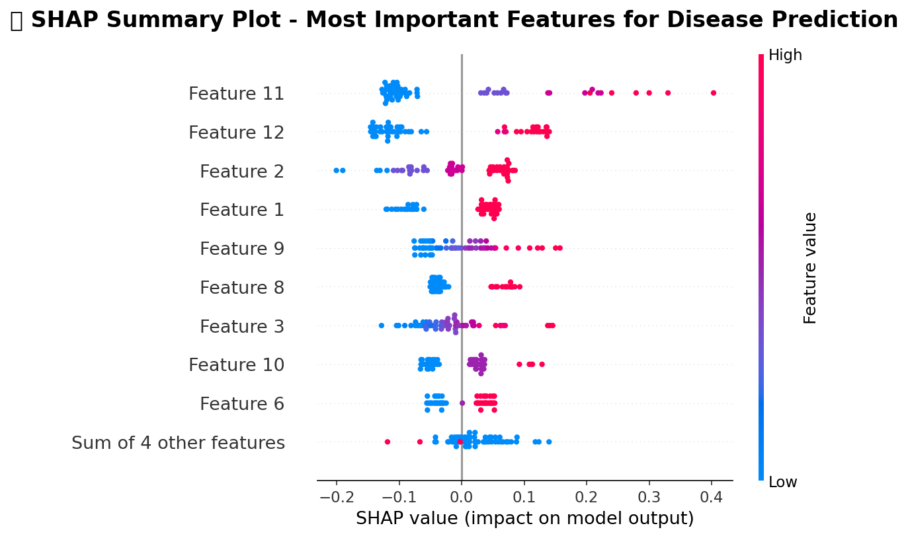
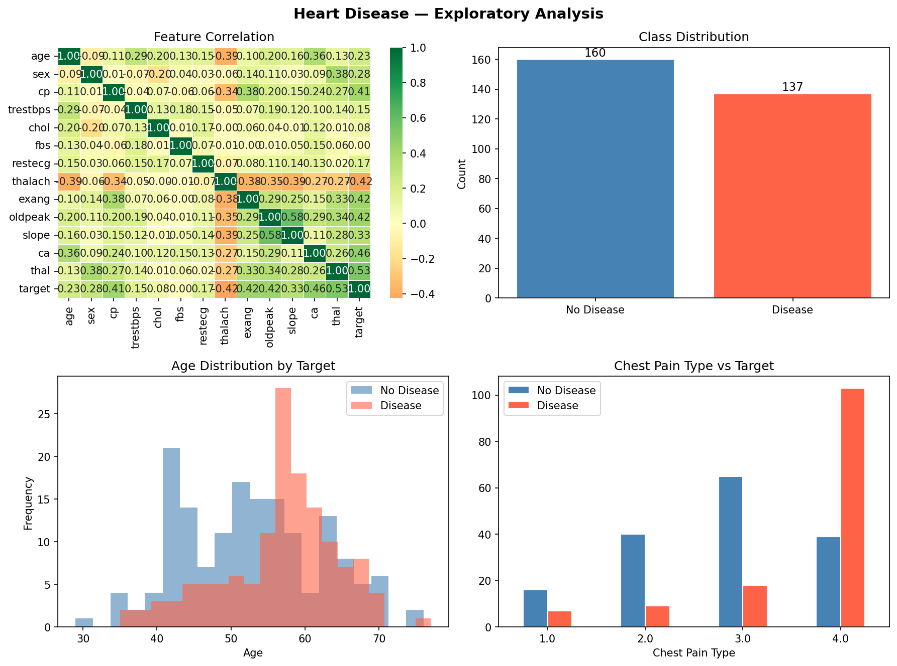

<p align="center">
  <a href="https://www.python.org/" target="_blank">
    
  </a>
  <a href="https://flask.palletsprojects.com/" target="_blank">
    
  </a>
  <a href="https://scikit-learn.org/" target="_blank">
    
  </a>
  <a href="https://shap.readthedocs.io/" target="_blank">
    
  </a>
  <a href="https://mit-license.org/" target="_blank">
    
  </a>
</p>

<h1 align="center">Cardiovascular Risk Assessment</h1>

<p align="center">
  <strong>AI-Powered Hospital Diagnostic System with Explainable Predictions</strong>
</p>

<p align="center">
  A professional-grade web application that leverages machine learning and SHAP (SHapley Additive exPlanations) to assess cardiovascular disease risk, generate hospital-style diagnostic reports, and provide transparent, interpretable predictions for clinical decision support.
</p>

<p align="center">
  <a href="#features">Features</a> •
  <a href="#screenshots">Screenshots</a> •
  <a href="#quick-start">Quick Start</a> •
  <a href="#architecture">Architecture</a> •
  <a href="#api-reference">API Reference</a> •
  <a href="#contributing">Contributing</a>
</p>

---

## Screenshots

<p align="center">
  
</p>
<p align="center"><em>Professional hospital-style diagnostic report with risk assessment and AI explanations</em></p>

<table>
  <tr>
    <td align="center"><br/><em>Multi-Patient Risk Assessment</em></td>
    <td align="center"><br/><em>Risk Comparison Dashboard</em></td>
  </tr>
  <tr>
    <td align="center"><br/><em>SHAP Feature Importance Analysis</em></td>
    <td align="center"><br/><em>Exploratory Data Analysis</em></td>
  </tr>
</table>

---

## Features

### Clinical Assessment
- **13 Clinical Parameters** — Input comprehensive patient data including blood pressure, cholesterol, ECG results, and more
- **Real-Time Risk Scoring** — Instant cardiovascular risk percentage with color-coded severity levels
- **4-Tier Risk Classification** — LOW · MODERATE-LOW · MODERATE · HIGH with appropriate clinical urgency

### AI & Explainability
- **Logistic Regression Model** — Trained on the UCI Heart Disease dataset (297 patients, 83% accuracy)
- **SHAP Explainability** — Transparent AI decisions showing which factors increase or decrease risk
- **Risk Factors & Protective Factors** — Clearly identifies what's driving the prediction
- **Personalized Recommendations** — Actionable health advice tailored to the patient's risk level

### Visualization & Reporting
- **Hospital-Grade Reports** — Professional medical report layout with print-ready formatting
- **Patient Prediction Cards** — Visual risk indicators with color-coded circles
- **Risk Comparison Charts** — Bar charts comparing multiple patient risk profiles
- **SHAP Summary Plots** — Feature importance visualization for model transparency

### Privacy & Security (Extended Module)
- **Homomorphic Encryption Support** — Privacy-preserving inference using CKKS encryption scheme
- **Client-Server Architecture** — Patient data never leaves the hospital in plaintext
- **TenSEAL Integration** — Optional real HE with simulated fallback for development

---

## Quick Start

### Prerequisites

- Python 3.8 or higher
- pip (Python package manager)
- Git

### Installation

```bash
# Clone the repository
git clone https://github.com/monarchdev14/CARDIOVASCULAR-RISK-ASSESSMENT.git
cd CARDIOVASCULAR-RISK-ASSESSMENT

# Create virtual environment
python -m venv .venv

# Activate virtual environment
# Windows:
.venv\Scripts\activate
# macOS/Linux:
source .venv/bin/activate

# Install dependencies
pip install -r requirements.txt
```

### Running the Application

```bash
# Start the Flask server
python app.py
```

The application will be available at **http://127.0.0.1:5000**

### Usage

1. Open your browser and navigate to `http://127.0.0.1:5000`
2. Fill in the patient clinical data form
3. Click **"Generate Report"**
4. View the professional diagnostic report with:
   - Risk percentage and severity level
   - Clinical measurements summary
   - AI-explained risk and protective factors
   - Personalized health recommendations

---

## Architecture

```
CARDIOVASCULAR-RISK-ASSESSMENT/
│
├── app.py                           # Flask web application (main entry point)
├── heart_desease.py                 # Core ML model with SHAP explainability
├── predict_patients.py              # Batch patient prediction & visualization
├── breast_cancer_HE.py              # Homomorphic encryption module (CKKS)
│
├── templates/
│   └── index.html                   # Web interface (form + report display)
│
├── static/
│   └── styles.css                   # Professional medical theme styling
│
├── screenshots/                     # Application screenshots & demos
│   ├── report_demo.png
│   ├── patient_predictions.png
│   ├── risk_comparison.png
│   ├── shap_summary.png
│   └── eda_plots.png
│
├── docs/                            # Additional documentation
│   └── API.md                       # Detailed API documentation
│
├── requirements.txt                 # Python dependencies
├── .gitignore                       # Git ignore rules
├── LICENSE                          # MIT License
├── CONTRIBUTING.md                  # Contribution guidelines
├── CODE_OF_CONDUCT.md               # Community code of conduct
├── SECURITY.md                      # Security policy
└── README.md                        # This file
```

### Data Flow

```mermaid
graph LR
    A[Patient Input Form] -->|JSON POST| B[Flask API /api/predict]
    B --> C[Data Preprocessing]
    C --> D[StandardScaler Transform]
    D --> E[Logistic Regression Model]
    E --> F[SHAP Explainer]
    F --> G[Risk Assessment Report]
    G -->|JSON Response| H[Professional Report UI]
```



### Technology Stack

| Layer | Technology | Purpose |
|-------|-----------|---------|
| **Frontend** | HTML5, CSS3, JavaScript | Patient input form & report display |
| **Backend** | Flask (Python) | REST API & server-side logic |
| **ML Model** | scikit-learn | Logistic Regression classifier |
| **Explainability** | SHAP | Feature importance & model transparency |
| **Data Processing** | Pandas, NumPy | Data manipulation & preprocessing |
| **Visualization** | Matplotlib, Seaborn | Charts & diagnostic plots |
| **Encryption** | TenSEAL (optional) | Homomorphic encryption for privacy |

---

## Model Details

| Metric | Value |
|--------|-------|
| **Algorithm** | Logistic Regression |
| **Dataset** | UCI Heart Disease (Cleveland) |
| **Samples** | 297 patients |
| **Features** | 13 clinical parameters |
| **Accuracy** | ~83% |
| **Explainability** | SHAP (SHapley Additive exPlanations) |

### Clinical Features

| Feature | Description | Type |
|---------|-------------|------|
| `age` | Age in years | Continuous |
| `sex` | Sex (1 = male, 0 = female) | Binary |
| `cp` | Chest pain type (0-3) | Categorical |
| `trestbps` | Resting blood pressure (mm Hg) | Continuous |
| `chol` | Serum cholesterol (mg/dL) | Continuous |
| `fbs` | Fasting blood sugar > 120 mg/dL | Binary |
| `restecg` | Resting ECG results (0-2) | Categorical |
| `thalach` | Maximum heart rate achieved | Continuous |
| `exang` | Exercise-induced angina | Binary |
| `oldpeak` | ST depression induced by exercise | Continuous |
| `slope` | Slope of peak exercise ST segment | Categorical |
| `ca` | Number of major vessels (0-3) | Discrete |
| `thal` | Thalassemia type (1-3) | Categorical |

---

## API Reference

### `POST /api/predict`

Generate a cardiovascular risk assessment report.

**Request Body:**

```json
{
  "name": "John Doe",
  "age": 52,
  "sex": 1,
  "cp": 2,
  "trestbps": 145,
  "chol": 280,
  "fbs": 1,
  "restecg": 2,
  "thalach": 120,
  "exang": 1,
  "oldpeak": 3.5,
  "slope": 2,
  "ca": 2,
  "thal": 3,
  "height": 175,
  "weight": 82,
  "symptoms": "Chest pain during exercise",
  "pregnant": "0",
  "underlying_sickness": "1",
  "overweight": "1",
  "injury": "0",
  "symptoms_duration": "2 weeks"
}
```

**Response:**

```json
{
  "success": true,
  "report": {
    "name": "John Doe",
    "age": 52,
    "gender": "Male",
    "risk_percentage": 90.1,
    "risk_level": "HIGH RISK",
    "risk_color": "#d62728",
    "clinical_measurements": [
      {"label": "Blood Pressure", "value": "145 mmHg"},
      {"label": "Cholesterol", "value": "280 mg/dL"},
      {"label": "Max Heart Rate", "value": "120 bpm"}
    ],
    "possible_diagnosis": ["Coronary Artery Disease (CAD)", "Myocardial Infarction"],
    "risk_factors": [
      {"feature": "thal", "value": 3, "impact": 0.42},
      {"feature": "ca", "value": 2, "impact": 0.31}
    ],
    "protective_factors": [],
    "recommendations": [
      "URGENT: Schedule cardiology consultation within 1 week",
      "Undergo comprehensive cardiac evaluation and stress testing"
    ]
  }
}
```

---

## Homomorphic Encryption Module

The `breast_cancer_HE.py` module demonstrates **privacy-preserving medical inference** using homomorphic encryption:

- **Polynomial Sigmoid Activation** — Uses `σ(z) ≈ 0.5 + 0.197z − 0.004z³` for HE compatibility
- **Simulated Mode** — No external dependencies required for development
- **Real CKKS Mode** — Full encryption with TenSEAL (toggle `USE_TENSEAL = True`)
- **Client-Server Separation** — Hospital encrypts data, server infers on ciphertext, hospital decrypts result

```bash
# Run the HE demo (simulated mode)
python breast_cancer_HE.py

# For real encryption:
pip install tenseal
# Set USE_TENSEAL = True in breast_cancer_HE.py
```

---

## Contributing

We welcome contributions! Please see our [Contributing Guidelines](CONTRIBUTING.md) for details.

1. Fork the repository
2. Create your feature branch (`git checkout -b feature/amazing-feature`)
3. Commit your changes (`git commit -m 'Add amazing feature'`)
4. Push to the branch (`git push origin feature/amazing-feature`)
5. Open a Pull Request

---

## License

This project is licensed under the MIT License — see the [LICENSE](LICENSE) file for details.

---

## Medical Disclaimer

> **This is an AI-powered assessment tool for informational and educational purposes only.**
>
> This application does **NOT** constitute a medical diagnosis. The predictions and recommendations generated are based on statistical models and should not replace professional medical advice.
>
> **Always consult with qualified healthcare professionals for medical advice, diagnosis, and treatment.**

---

## Acknowledgments

- **UCI Machine Learning Repository** — [Heart Disease Dataset](https://archive.ics.uci.edu/ml/datasets/heart+disease) (Cleveland database)
- **SHAP** — [SHapley Additive exPlanations](https://github.com/slundberg/shap) for model interpretability
- **scikit-learn** — Machine learning framework
- **Flask** — Web application framework
- **TenSEAL** — Homomorphic encryption library

---

<p align="center">
  Made with care for better healthcare through AI
</p>

<p align="center">
  <a href="https://github.com/monarchdev14/CARDIOVASCULAR-RISK-ASSESSMENT/stargazers">Star this repo</a> •
  <a href="https://github.com/monarchdev14/CARDIOVASCULAR-RISK-ASSESSMENT/issues">Report Bug</a> •
  <a href="https://github.com/monarchdev14/CARDIOVASCULAR-RISK-ASSESSMENT/issues">Request Feature</a>
</p>
